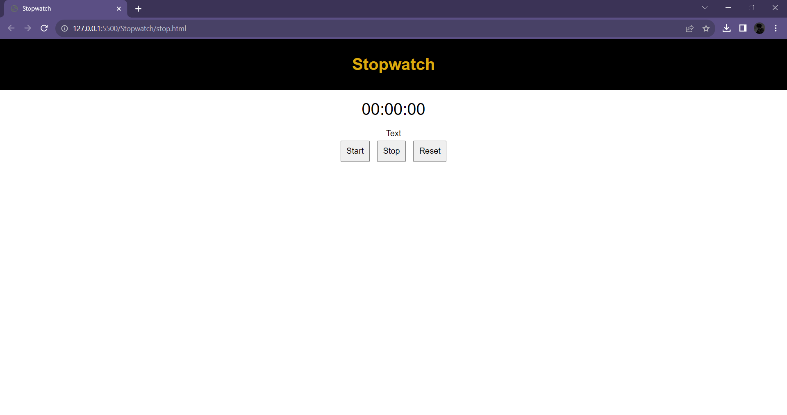

# CountdownTimer - TechnoHacks

## Aim 
To create a countdown timer that counts down from a set time to zero, with options to stop, reset, and restart the timer.

## Program 
stop.html
```
<!DOCTYPE html>
<html lang="en">
<head>
  <meta charset="UTF-8">
  <meta name="viewport" content="width=device-width, initial-scale=1.0">
  <title>Stopwatch</title>
  <link rel="stylesheet" href="stop.css">
</head>
<body>

<header>
  <h1>Stopwatch</h1>
</header>

<div id="stopwatch">00:00:00</div>
<div style="margin-top: 10px">Text</div>
<button id="startBtn" onclick="startStopwatch()">Start</button>
<button id="stopBtn" onclick="stopStopwatch()">Stop</button>
<button id="resetBtn" onclick="resetStopwatch()">Reset</button>

<script src="stop.js"></script>

</body>
</html>
```
stop.css
```
body {
    font-family: Arial, sans-serif;
    text-align: center;
    text-align:             bottom;
    margin: 0;
    padding: 0;
  }
  
  header, footer {
    background-color: 	#000000;
    color: rgb(219, 171, 13);
    padding: 10px;
  }
  
  #stopwatch {
    font-size: 2em;
    margin: 20px;
  }
  
  button {
    font-size: 1em;
    margin: 5px;
    padding: 10px;
  }
```
stop.js
```
let stopwatch;
let elapsedSeconds = 0;
let isRunning = false;

function updateStopwatchDisplay() {
  const hours = Math.floor(elapsedSeconds / 3600);
  const minutes = Math.floor((elapsedSeconds % 3600) / 60);
  const seconds = elapsedSeconds % 60;

  document.getElementById('stopwatch').textContent = `${String(hours).padStart(2, '0')}:${String(minutes).padStart(2, '0')}:${String(seconds).padStart(2, '0')}`;
}

function startStopwatch() {
  if (!isRunning) {
    stopwatch = setInterval(() => {
      elapsedSeconds++;
      updateStopwatchDisplay();
    }, 1000);
    isRunning = true;
    document.getElementById('startBtn').textContent = 'Pause';
  } else {
    stopStopwatch();
  }
}

function stopStopwatch() {
  clearInterval(stopwatch);
  isRunning = false;
  document.getElementById('startBtn').textContent = 'Resume';
}

function resetStopwatch() {
  clearInterval(stopwatch);
  elapsedSeconds = 0;
  isRunning = false;
  updateStopwatchDisplay();
  document.getElementById('startBtn').textContent = 'Start';
}

updateStopwatchDisplay(); // Initial display
```

## Output
